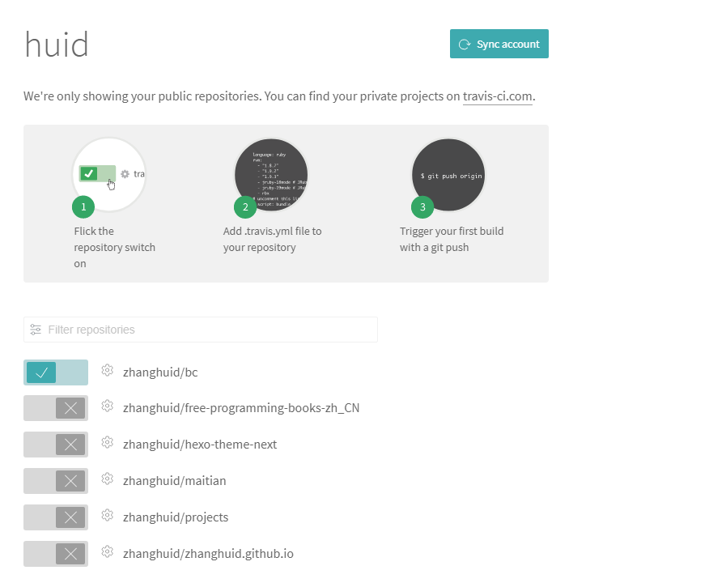

### 练习如何使用travis进行持续集成

#### 一般的目录结构如下：
```
src/
    xxx.php
tests/
    xxx.php
vendor
    xxxx
.travis.xml
composer.json
phpunit.xml
```

#### .travis.xml，预设运行脚本环境跟需要执行的命令
```yml
# 指定编程语言为php
language: php
# 指定php的版本
php:
  - 7.0
  - 7.1
# 
dist: trusty
sudo: false
# install字段用来指定安装脚本。
install: composer install
# script字段用来指定构建或测试脚本
script: vendor/bin/phpunit --verbose
```

#### composer.json
```php
### 值得注意的是：`Huid\\Bc\\`是指src目录命名空间；`Huid\\Bc\\Tests`为tests目录的命名空间
    "autoload": {
        "psr-4": {
            "Huid\\Bc\\": "src"
        }    
    },
    "autoload-dev": {
        "psr-4": {
            "Huid\\Bc\\Tests\\": "tests"
        }
    },
### 在BcTest文件里，需要如下引入:
    use Huid\Bc\Bc;
    use Huid\Bc\Tests\TestCase;    
```

#### phpunit.xml文件是phpunit命令运行的配置文件
- 当执行配合travis.yml里的命令执行
`vendor/bin/phpunit --verbose`

#### 实践
- 登录[travis](https://travis-ci.org/)，使用`github`帐号登录，`travis`会自动读取你的github账户里的仓库。
- 在你[个人中心](https://travis-ci.org/profile/)里有如图
- 切换开关，即可自动测试
